# mock和easymock

### WHY? [mock.js](http://mockjs.com/) 
  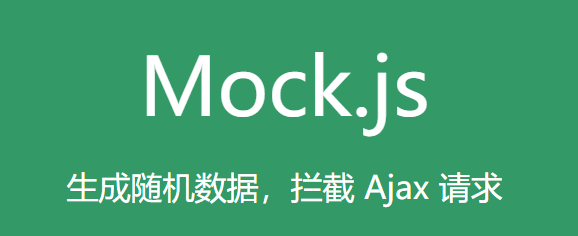
### and [easymock](https://www.easy-mock.com/)
  

  对于全端开发工程师在与后台同学协同开发的时候会遇到问题: *(问号脸)后台接口都没有,请求个吉尔?* 
  我们只能使用比如Apache/node等后台语言搭建一个服务器,再加上Mysql数据库加上可视化Navicat,给我们提供数据服务. **很烦**,因为我们要模拟假数据表,关联数据库,测试运行后台服务并解决跨域等问题,然后才能做 **前端开发**,很难受,假如**有一款在线工具能按照我们的接口文档咔咔往上整数据,然后发送的ajax请求都能响应且数据格式正确**, 这就很舒服 ,最好**能和Vue等主流框架配合使用**那就更舒服了(`到vue再说`).


**面试装逼:** *Mock.js*是一款前端开发中拦截Ajax请求再生成随机数据响应的工具.可以用来模拟服务器响应. 优点是非常简单方便, 无侵入性, 基本覆盖常用的接口数据类型.

****
****

## 思考: 提个简单的开发需求: 
  ```js
  请求后台某个接口,返回10-15条学生数据: 要求包含 姓名,年龄,性别. 成功状态码:200 .成功状态信息: success.

  `响应数据结构分析:`
  {
    status:200,
    msg:'success',
    stuInfo:
      {
        name:'abc',
        age:10,
        gender:0
      }
      ,
      ...
      ,
      {
        name:'abc',
        age:10,
        gender:0
      }
    ]
  }
  `方法1: 模拟后台(node/php + mysql)`
    1,搭建node服务器/Apache服务器 
    2,开启Mysql服务, 制定数据库,数据表,添加表信息(添加姓名,年龄,性别的值 和 值类型)
    3,使用node或者php语法关联数据库,声明查询sql语句,并执行sql.
    4,将查询db内容处理为json返回
  代码量: 前端ajax+模板引擎20行左右 + 后台实现代码40行左右 + 繁琐的数据表设计 + 一条条的添加数据库内容  =  BOOM心态爆炸!!!

  // 或者你可以...
  `方法2: 完全脱离后台和数据库(mockjs配合vue的拦截器),或者 脱离数据库操作(mockjs简单的node后台)`
    1,搭建node服务器
    2,使用mockjs的mock方法制定随机数据
    3,处理为json返回
  代码量: 前端ajax+模板引擎20行左右 + node服务响应mock数据11行 = 咦嘿嘿很开心!
  代码:
    const app = reqire('express')
    const Mock = require('mockjs')
    app.get('/someApi',(req,res)=>{
      var resData = Mock.mock({
        'status':200,
        'msg':'success',
        'stuData|10-20':[{
          'name|1-3':/[a-z][A-Z]/,
          'age|+1':10,
          'gender|1':true
        }]
      })
      res.end(JSON.stringify(resData))
    })
    app.listen(3000)
  ```
****
****

## 一 Mockjs怎么用?
### 1 mock.js的使用
##### 1.1.1 安装并引入mock.js
  创建一个node服务器--server.js文件
  ```js
  // 引入express
  const express = require('express');
  // 创建服务对象
  const app = express()
  // 准备数据
  var data = '123'
  // 监听路由
  app.get('/', (req, res) => { 
    res.end(data);
  })
  // 开启服务
  app.listen(3000)
  ```
##### 1.1.2 安装并引入mock.js
  ```git 
  npm install mockjs 
  或者 
  script:src="http://mockjs.com/dist/mock.js"
  ```
##### 1.1.3 mockjs模块模拟数据
```js
  // 引进express
  const express = require('express');
  // 引进mockjs
  const Mock = require('mockjs')

  // 准备服务对象
  const app = express()

  // 监听路由
  app.get('/', (req, res) => {

    // 准备随机数据
    var data = Mock.mock({
      'list|1-20': [{
        'name|3-5': /[a-z][A-Z]/,
        'age|10-15': 15,
        'gender|1': true,
      }]
    })
    res.end(JSON.stringify(data));
  })

  // 开启服务
  app.listen(3000)
```
##### 1.1.4 测试服务
在terminal窗口中运行命令nodemoon server.js
在浏览器中请求127.0.0.1:3000 观察响应体
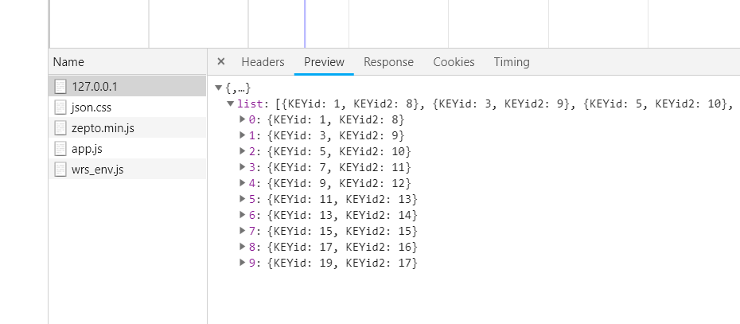
##### 1.1.5 使用
这样在ajax请求相关接口就能返回内容随机,结构固定的JSON数据了
****

#### 2 [mockjs语法](https://github.com/nuysoft/Mock/wiki/Syntax-Specification)
##### 2.1 **Mock.mock()方法**
  加对象参数就可以生成响应数据
  ****
##### 2.2 参数对象模板规则
  - **属性名|生成规则：属性值 name | rule : value**  
  - **name**: 生成数据的名字字符串
  - **|**: 一定要加
  - **rule**: 生成数据的规则
            |min-max                  生成个数min至max条
            |count                    生成count条
            |min-max.dmin-dmax        1-9.2-3  数字值在1-9之间,小数点后保留2-3位  如 2.1   3.74
            |min-max.dcount           1-9.2     数字值在1-9之间,小数点后保留2位   如2.13  8.54
            |count.dmin-dmax          10.1-2    整数部分是10,小数点部分1-2位      如10.99   10.1
            |count.dcount             10.2      整数部分是10,小数点部分2位        如10.11   10.43
            |+step                    'score|+1':1,   以value 1为基准,递增1
  - **value**: 属性值的规则
    - 字符串
              'name|min-max': string 
              通过重复 string 生成一个字符串，min<=重复次数<=max

              'name|count': string 
              通过重复 string 生成一个字符串，重复次数==count。
    - 数字
              'name|+1': number 
              属性值自动加 1，初始值为 number。

              'name|min-max': number    
              number确定数据类型,生成值在min-max间的整数

              'name|min-max.dmin-dmax': number
              number确定数据类型,生成值在min-max间的小数
    - 布尔
              'name|1': boolean
              随机生成一个布尔值,真假各50%
    - 对象
              'name|count': object
              从属性值 object 中随机选取 count 个属性。

              'name|min-max': object
              从属性值 object 中随机选取 min 到 max 个属性。
    - `数组`  

              'name|1': array
              从属性值 array 中随机选取 1 个元素，作为最终值。

              'name|+1': array
              从属性值 array 中顺序选取 1 个元素，作为最终值。

              'name|min-max': array
              通过重复属性值 array 生成一个新数组，重复次数大于等于 min，小于等于 max。

              'name|count': array
              通过重复属性值 array 生成一个新数组，重复次数为 count。
              
              var data = mock.mock({
                // 将value数组中的项(对象) 重复计算1-10次 添加到新数组返回
                'obj|1-10':[
                  {
                    'score|+1':1
                  }
                ]
              })
              //生成 { obj: [ { score: 1 }, { score: 2 }, { score: 3 }, { score: 4 } ] }

              
    - 函数(不用)
              'name': function
              执行函数 function，取其返回值作为最终的属性值，函数的上下文为属性 'name' 所在的对象。
    - 正则
              'name': regexp
              根据正则表达式 regexp 反向生成可以匹配它的字符串。用于生成自定义格式的字符串。/[a-z][A-Z][0-9]/  /\w\W\s\S\d\D/  /\d{5,10}/ [\u4e00-\u9fa5]	
  ****
##### 2.3  **Mock.valid( template, data )** 校验数据(处理请求发送来的数据,如果完全脱离后台就需要该方法)
  + `在vue中可以脱离后台开发(到下个自习说)`
  + **template** 必选, 表示数据模板，可以是对象或字符串
  + **data** 必选, 表示真实数据
    ```js
        // 可以用来做基于mock的ajax请求参数的处理
        var template = {
            name: 'value1'
        }
        var data = {
            name: 'value2'
        }
        Mock.valid(template, data)//返回值是一个校验结果数组
        // 如果匹配则 返回空数组
        // 如果不匹配 messages属性表示tteamplate和data不匹配的原因
    ```
  ****
##### 2.4 [Mock.random](https://github.com/nuysoft/Mock/wiki/Mock.Random)工具对象
  + Mock.Random 是一个工具类，`用于生成各种随机数据。不用掌握,用到就点击蓝字查`
  ****
# 3 easymock的使用
  
#### 3.1 [`注册`](https://www.easy-mock.com/login)
  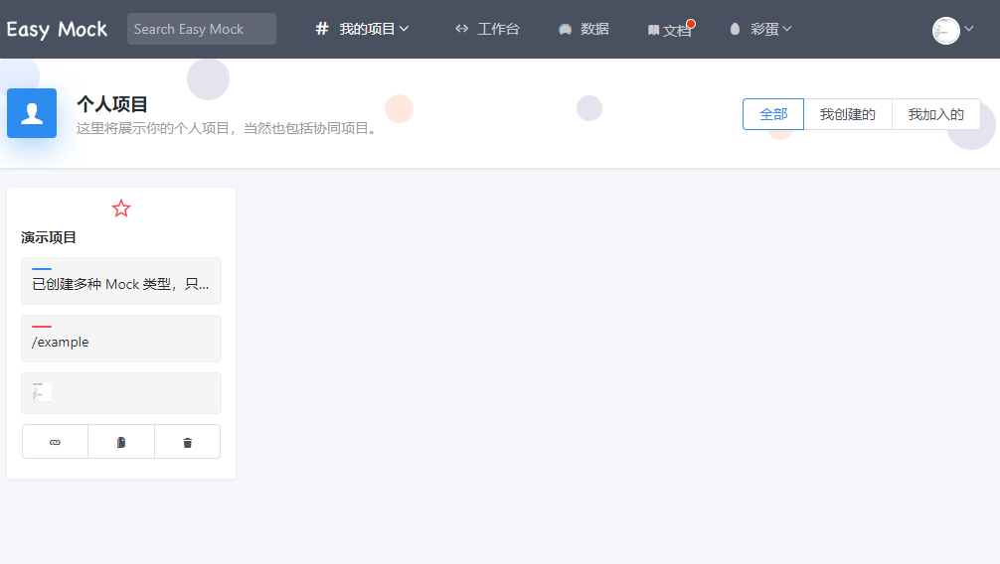
#### 3.2 注意右侧的[`使用文档`](https://www.easy-mock.com/docs)右键新窗口打开
  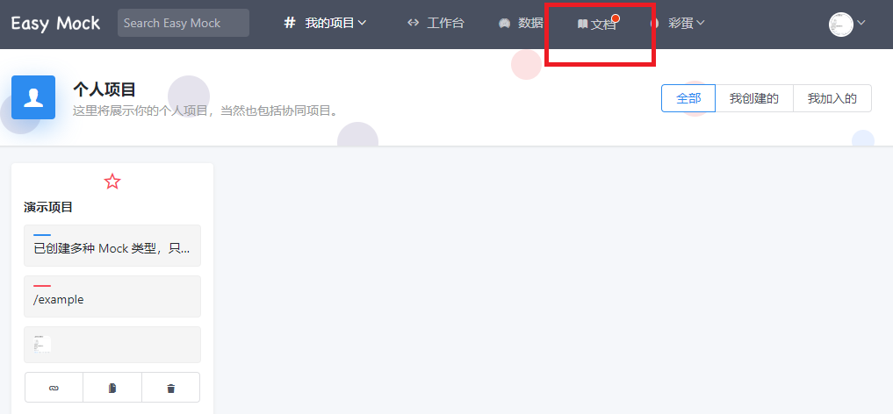
#### 3.3 `快速开始 - 创建一个项目` 点击左侧演示项目
  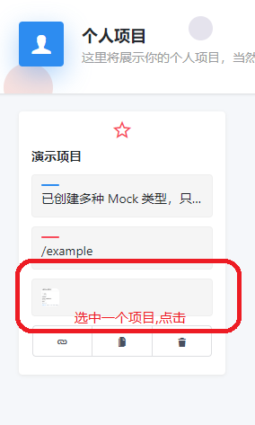
#### 3.5 `打开项目设置` 
  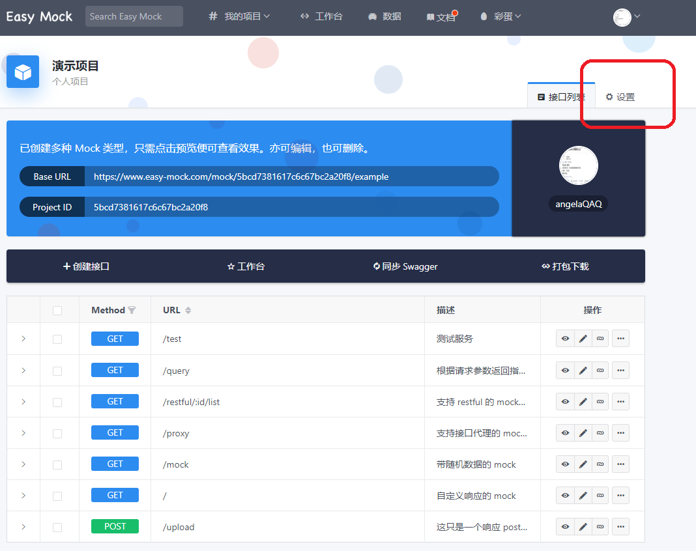
#### 3.6 `配置接口`点击保存,提示更新成功就OK了
  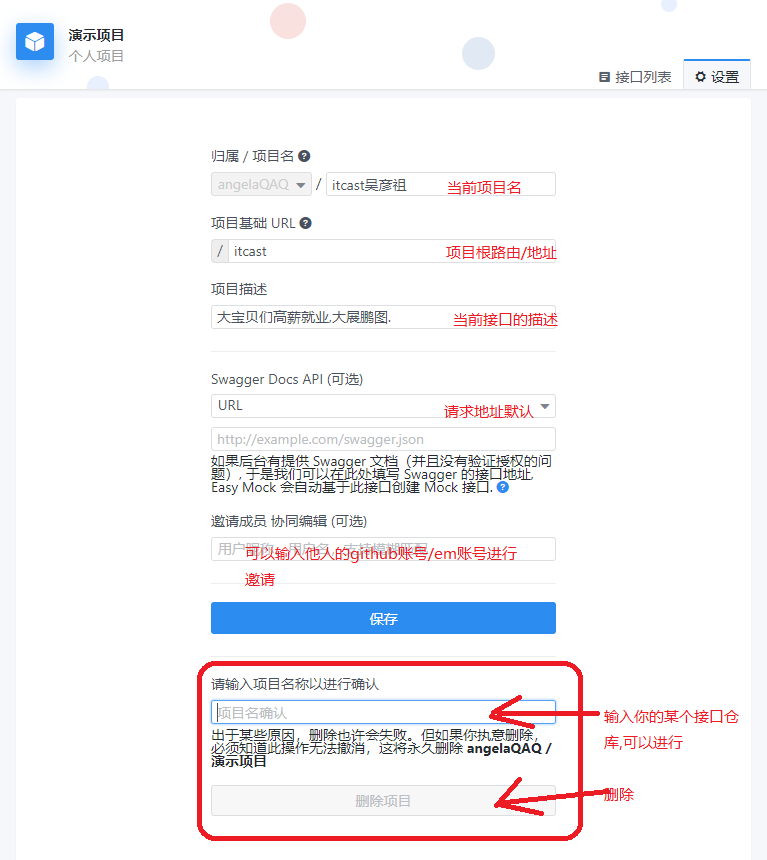
#### 3.7 `接口列表配置`
    记录当前项目的基本地址  `Base URL,注意要记录自己项目的啊!`
    https://www.easy-mock.com/mock/5bcd7381617c6c67bc2a20f8/itcast
    点击3.1左侧项目,进入个人项目,点击创建接口
  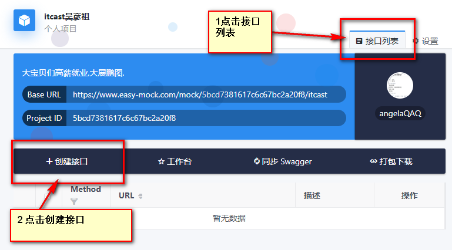
#### 3.8 `接口配置页面`: 左侧是当前接口返回值设置,右侧接口请求方式,地址等设置
  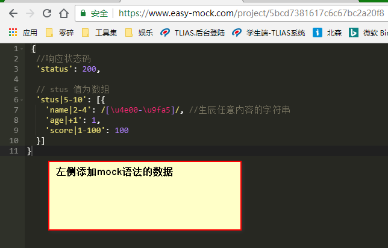  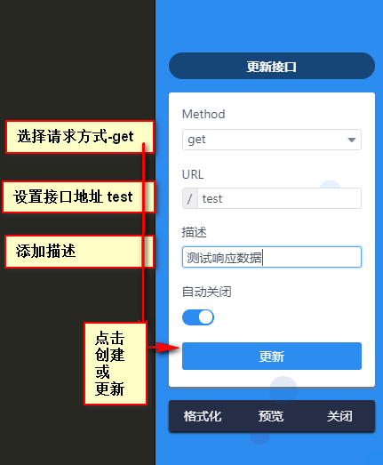
  将以下代码粘贴至左侧区域,并配置右侧选项
  ```js
  {
  //响应状态码
  'status': 200,

  // stus 值为数组
  'stus|5-10': [{
    'name|2-4': /[\u4e00-\u9fa5]/, //生辰任意内容的字符串
    'age|+1': 1,
    'score|1-100': 100
  }]
}
  ```
#### 3.9创建或更新接口后会返回到列表页面, **点击预览按钮**
    如果能够看到响应的数据,就说明本次请求配置是欧克的
  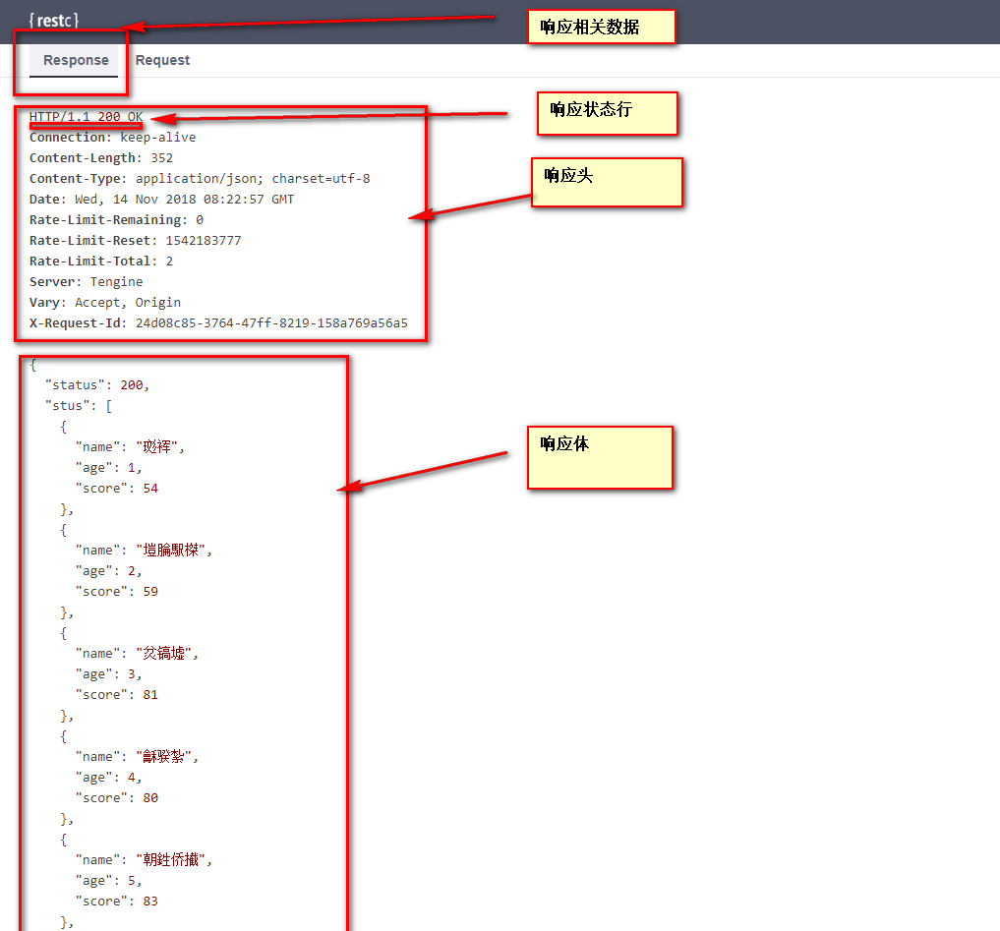
  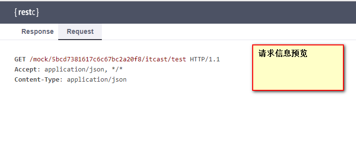
#### 3.10使用 **POSTMan**测试接口
    `拼接地址注意: 要使用easymock项目的BaseUrl 和 测试接口的地址"test"拼接`
  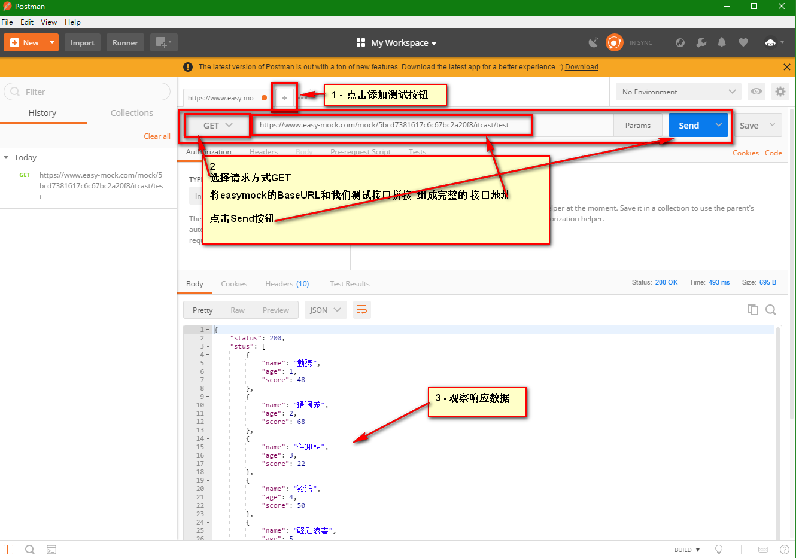

#### 3.11欧克,现在你可以脱离数据库及后台的配置发送ajax请求直接拿数据啦!
